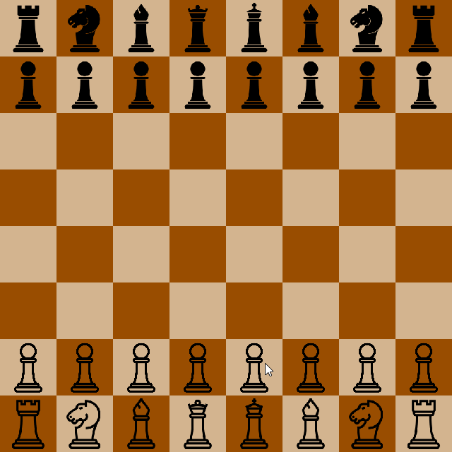

# Chess
An Object-Oriented Java Chess Program.

## Features

Implements most FIDE - World Chess Federation rules.

Including: Pawn promotion, castling, en passent, stalemate, and three-fold repetition.

## Design

The main goal of this project was to produce a clean, modular, and well-structured codebase using Object-Oriented principles. 
Classes and functions are coded to emphasize readability with the idea that hopefully visitors will be able to jump into any class
and have an immediate idea of what's going on, with minimal effort required to understand the execution of important functions.  

Frequent refactorings were done with reference to: "Refactoring: Improving the Design of Existing Code" by Martin Fowler, in an effort to maintain code quality.

The JUnit test suite was designed to follow black box testing practices, and tests various board configurations against expected board states.

## Tools

Written entirely in Java, this project makes use of the Java Swing API to run the game's GUI, as well as JUnit 5 for unit testing.

## How to download and run

... Will add shortly ...
